# Doit

> 이루고 싶은 목표를 하루단위로 쪼개 실천해 나가면서 목표를 습관으로 바꿔나가도록 돕는 소셜네트워크 플랫폼

## 📙Doit 소개

- 개발기간 : 2021.01.06 ~ 2021.02.19
- 웹사이트 : Doit(두잇)
  -   '모든 사람이 강한의지를 갖고 있지는 않다는 문제점'에서 시작
  -   함께할때 더 즐겁고, 동기부여를 갖는 사람을 위한
  -   무료한 일상에 새로운 습관을 더하고 싶은 사람을 위한
  -   평소 매번 실패했던 목표를 나의 습관으로 바꾸고 싶은 사람을 위한 SNS 플랫폼

- 팀원 소개

## 🔧Tech Stack

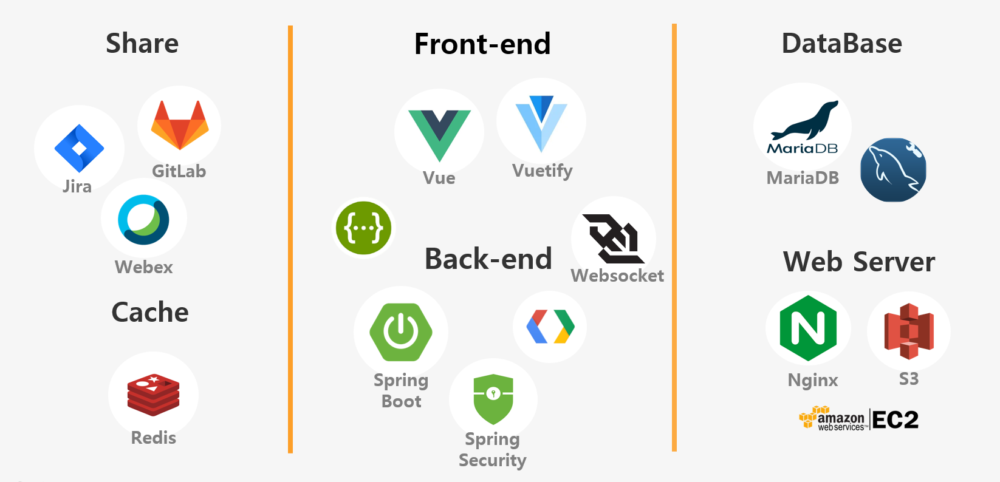

## 💎주요기능

#### 검색

> 새로 가입할 그룹을 다양한 방식으로 추천받을수 있는 검색기능

- 워드클라우드 : 그룹 생성시 작성하는 해시태그를 인기도에 따라 크기를 다르게한 워드클라우드를 통해 편리한 검색기능
- 그룹 랭킹 : 일별 그룹 점수가 높은 그룹을 순위별로 제공 
- 카테고리 : 글작성시 등록한 카테고리 별로 검색 가능

#### 그룹활동

> 주제 별 그룹 안에서 인증글을 올리고 그룹원들간 서로 인증

- 인증기능
  - 그룹 내에 인증글을 등록 후 그룹원들이 인증 확인을 해줌
  - 총 그룹원의 70%이상이 인증확인 해주어야 인증 완료
  - 인증완료 됐을 경우, 인증 확인 받은 글에 **인증** 도장 획득
  - 인증완료 됐을 경우, 그룹 멤버 소개 탭에서 **오늘인증** 도장 획득
- 알림기능
  - 내가 가입한 그룹에 새 글이 등록될 경우
  - 내가 올린 인증글이 그룹원들에게 인증을 받았을 경우
  - 내가 올린 인증글에 댓글이 달렸을 경우
  - 그룹장으로 위임 됐을 경우
  - 그룹에서 강퇴 강했을 경우
  - 1:1 채팅메세지를 받았을 경우

#### 금잔디

> 나의 습관 실천 내역을 시각화해서 확인하기

- 인증완료 됐을 경우, 마이페이지의 인증글의 등록날짜의 금잔디가 짙어짐
- 지난 30일간의 기록을 제공
- 인증을 여러개 획득할 경우 색이 더 짙어짐

#### 마일리지

> 그룹활동에 대한 보상으로 물품 거래

- 마일리지 적립

  - 적립 : 로그인, 그룹가입, 피드등록, 인증완료
  - 차감 : 그룹 강퇴, 그룹 탈퇴

- 마일리지 사용

  - 판매자는 마일리지샵에 팔고싶은 물품을 등록
  - 구매자는 마일리지샵에서 구매하고자 하는 물품상세페이지 하단의 채팅하기 버튼을 통해 구매자와 1:1 채팅
  - 판매자는 다수의 구매희망자 중 1명을 예약/예약취소 가능, 예약시 다른 구매희망자의 예약버튼이 모두 비활성화되고 예약취소시 활성화됨
  - 거래 후 거래자와 판매자 양쪽에서 거래가 확인되면 구매자의 마일리지가 판매자에게로 전달

#### 웹/모바일 반응형 설계

> breakpoint 및 미디어 쿼리를 사용해 웹/모바일 반응형 설계
>
> 웹: 1280px 기준으로 설계, 1900px 이상에서도 바르게 나오도록 설계
>
> 모바일: iPhone 6/7/8 기준으로 설계

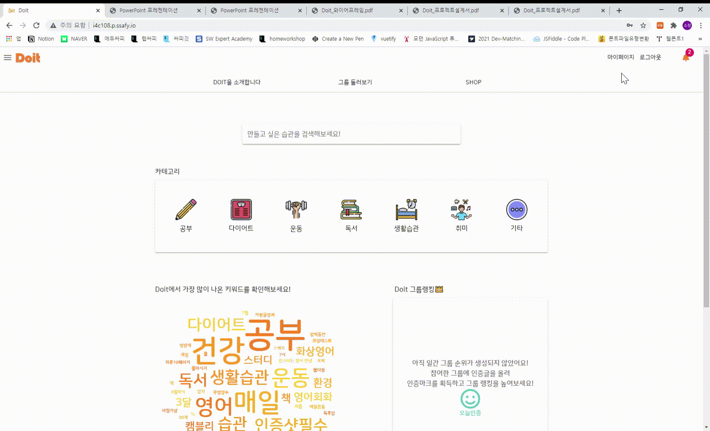

## 💻페이지소개

### Main

> 카테고리별, 인기해쉬태그별, 그룹랭킹별로 그룹을 검색 가능

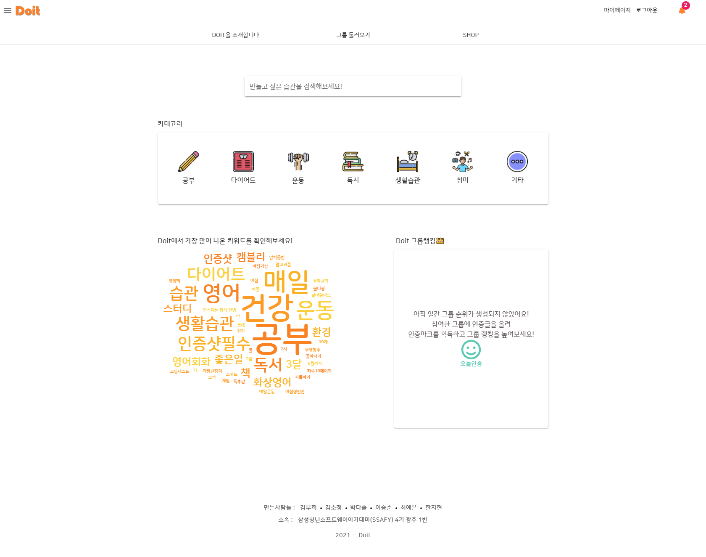

###  검색결과

> 카테고리별 검색, 키워드 검색(해쉬태그 기반) 가능

#### 카테고리 검색 결과

#### 키워드 검색 결과

### Group

> 그룹 메인 페이지에는 그룹의 기본 정보(현재 멤버수/제한멤버수, 그룹 활동날짜, 해쉬태그)와 그룹소개글, 가입멤버를 볼수 있는 `그룹정보`탭, 그룹원들이 활동한 인증글을 볼 수 있는 `인증피드` 탭으로 구성

#### 그룹정보

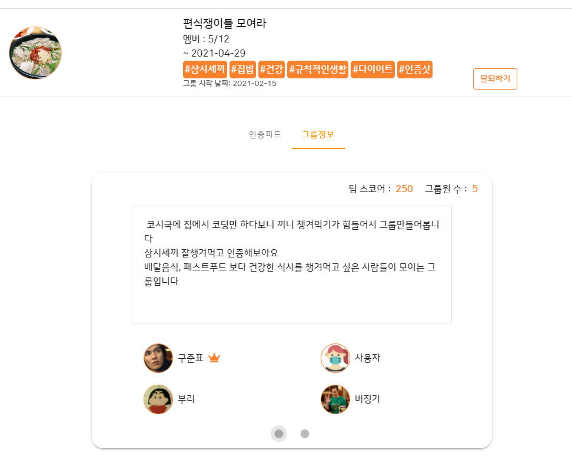

#### 인증피드

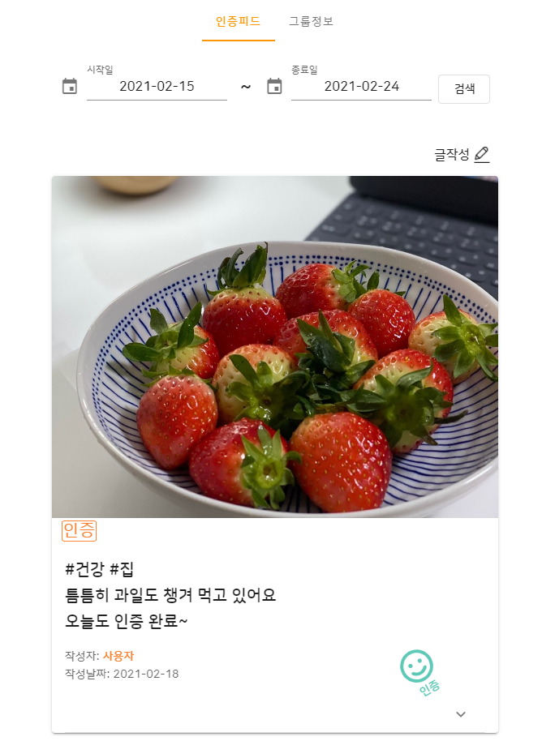

#### 그룹만들기

> 그룹을 만들 때, 그룹 만료일과, 최대 멤버수를 지정하고, 검색키워드에 걸릴 해쉬태그를 추가할 수 있다.

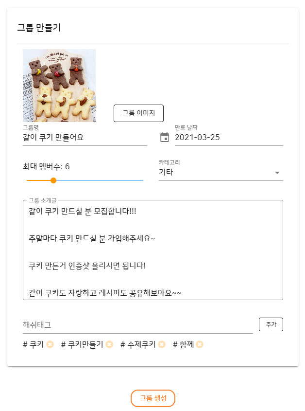

### Mileage Shop

> 그룹 활동에 대한 보상으로 적립받은 마일리지로 회원들과 물품을 거래 할 수 있다.
>
> 1:1 채팅으로 거래가 가능하고, 구매자와 판매자의 동의가 완료되면 마일리지가 전달된다.

#### 마일리지 Shop 메인

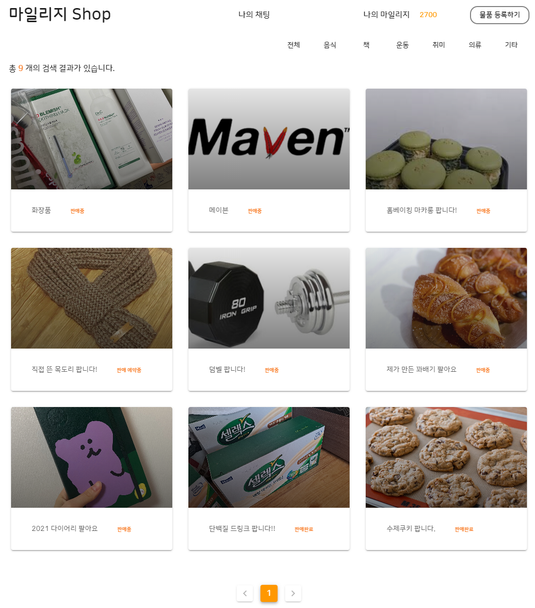

#### 물품 등록

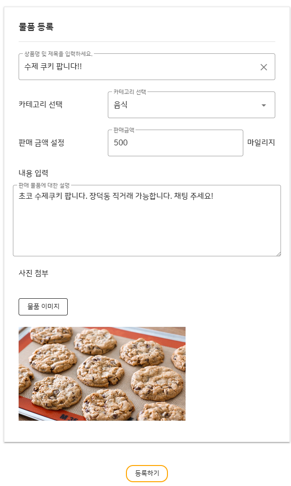

#### 물품 상세

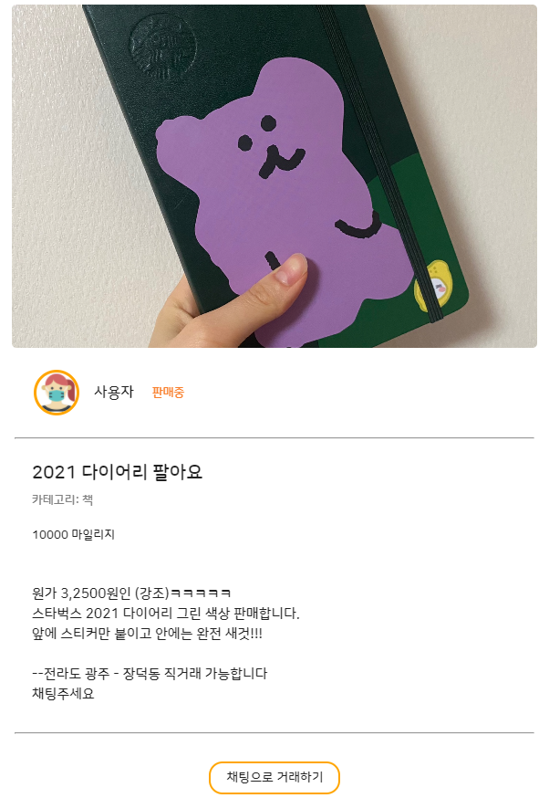

#### 1:1 채팅

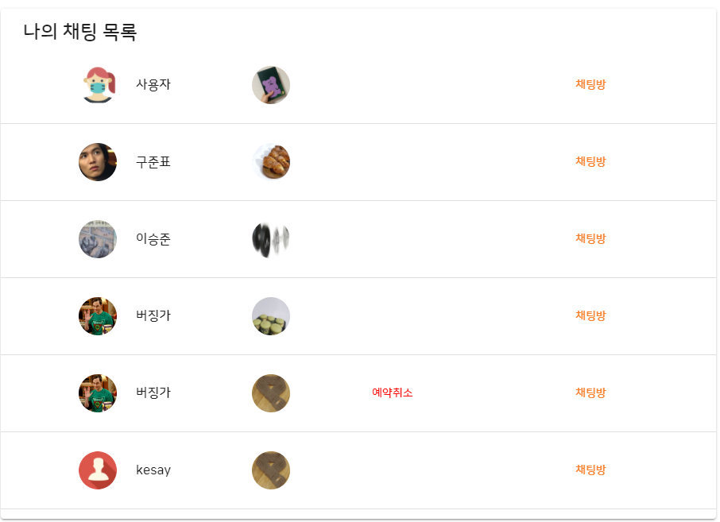

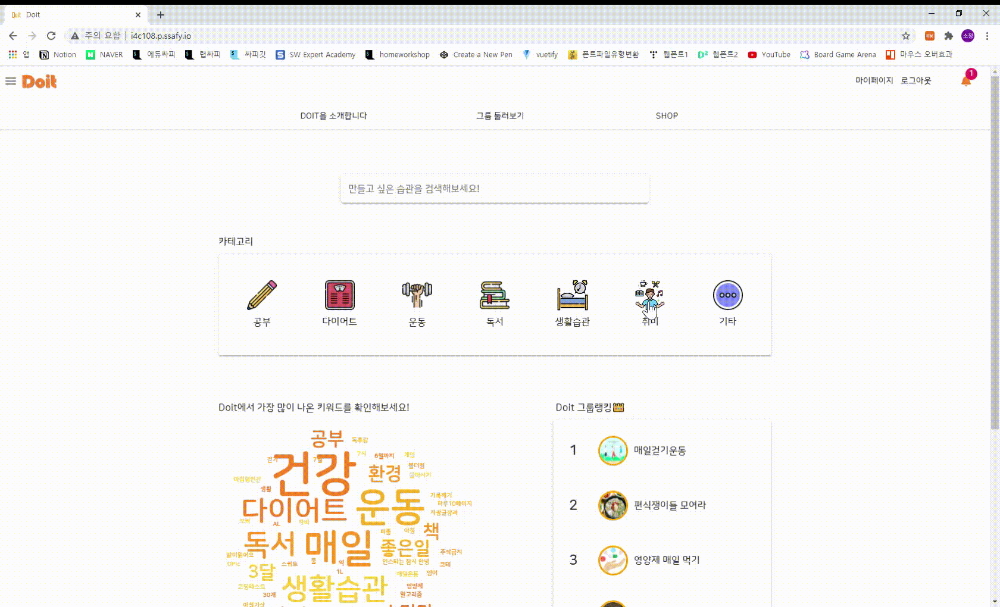

#### 마일리지 적립내역

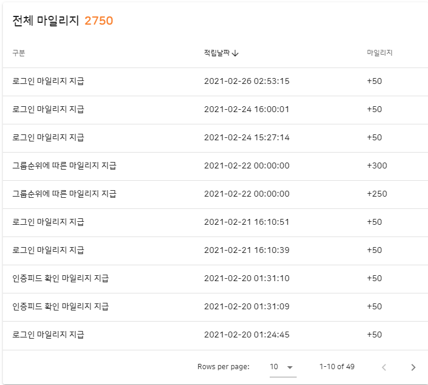

### MyPage

> 나의 그룹 활동을 한눈에 볼수 있는 금잔디 기능
>
> 내가 작성한 피드 내역
>
> 내가 가입한 그룹 리스트 확인

#### 잔디

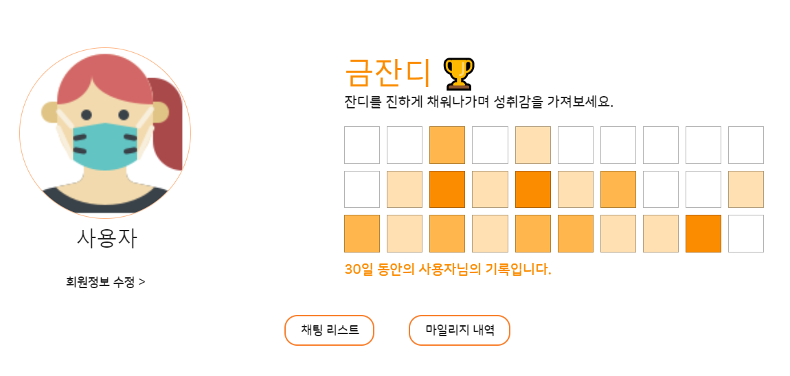

#### 작성한 피드 & 가입한 그룹 

